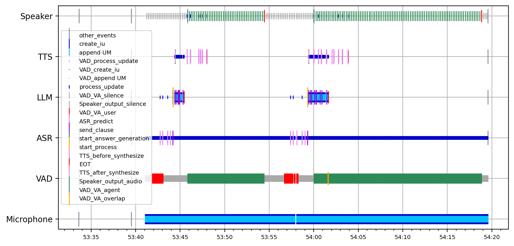

# Visualization of the system execution with the plot system

The retico-core package that is used to build this simple retico agent provides us with a basic logging and plotting system. The plotting system is simple : load the log messages stored in the log file, sort them according to the plot configuration file (here `src/simple-retico-agent/configs/plot_config_simple.json`) and use them to create a plot showing all log messages from all modules accross time. This system can easily be used in real time, as it can generate a plot repeatidly while the system is running.

For further information concerning the configuration of the plotting system, check the documentation : [https://retico-core-sos.readthedocs.io/en/latest/logs.html#configurate-plotting](https://retico-core-sos.readthedocs.io/en/latest/logs.html#configurate-plotting)

## Explanation of the `plot_config_simple.json` file and its visualization

*A plot from a finished system run*

A plot from a finished system run

Here is a list of all general log messages and there signification :

- create_iu
- append_UM
- process update
- start_answer_generation
- start_process
- send_clause
- EOT

Here is a list of all module-specific log messages and there signification :

- VAD_VA_silence :
- VAD_VA_user :
- VAD_VA_agent :
- VAD_VA_overlap :
- ASR_predict :
- TTS_after_synthesize :
- TTS_before_synthesize :
- Speaker_output_silence :
- Speaker_output_audio :
